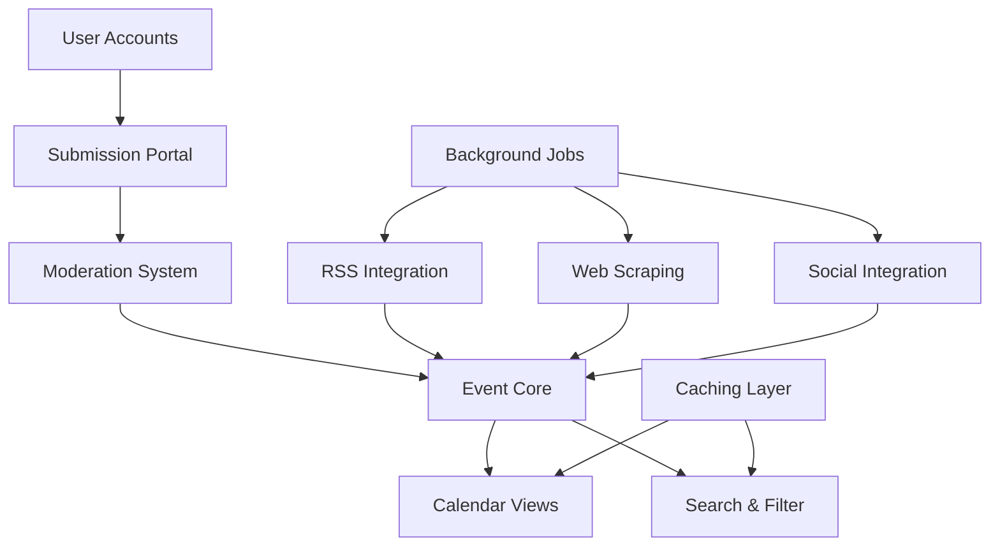

# Hiram Village Community Calendar - Rails Implementation Plan

## Overview
This document outlines a comprehensive implementation strategy for building the Hiram Village Community Calendar as a Ruby on Rails application, emphasizing Test-Driven Development (TDD), modular architecture, and efficient delivery.

## Architecture & Technology Stack

### Core Stack
- **Framework**: Rails 8.0.2.1 ✅ **IMPLEMENTED**
- **Ruby Version**: 3.3.8 ✅ **IMPLEMENTED**
- **Database**: PostgreSQL 15+ with PostGIS for geographic data ✅ **CONFIGURED**
- **Background Jobs**: Solid Queue (Rails 8 built-in) + Sidekiq for complex jobs
- **Frontend**: Hotwire (Turbo + Stimulus) ✅ **CONFIGURED** + Tailwind CSS
- **Testing**: RSpec, Capybara, FactoryBot, VCR
- **API Documentation**: Swagger/OpenAPI
- **Caching**: Solid Cache (Rails 8 built-in) ✅ **CONFIGURED**
- **Search**: PostgreSQL full-text search (initially), Elasticsearch (future)
- **File Storage**: Active Storage with S3
- **Deployment**: Docker containers ✅ **CONFIGURED** + Kamal ✅ **CONFIGURED**

### Current Gems (Rails 8.0.2.1)
```ruby
# CURRENTLY IMPLEMENTED ✅
gem "rails", "~> 8.0.2", ">= 8.0.2.1"
gem "pg", "~> 1.1"
gem "puma", ">= 5.0"
gem "turbo-rails"        # ✅ Hotwire included
gem "stimulus-rails"     # ✅ Hotwire included
gem "solid_cache"        # ✅ Rails 8 built-in caching
gem "solid_queue"        # ✅ Rails 8 built-in job processing
gem "solid_cable"        # ✅ Rails 8 built-in ActionCable
gem "brakeman"          # ✅ Security scanning included
gem "rubocop-rails-omakase" # ✅ Rails 8 styling
gem "capybara"          # ✅ System testing
gem "selenium-webdriver" # ✅ Browser automation

# PLANNED ADDITIONS
# Authentication & Authorization
gem 'devise'
gem 'pundit'

# API & Integrations
gem 'httparty'
gem 'feedjira' # RSS parsing
gem 'nokogiri' # Web scraping
gem 'koala' # Facebook API
gem 'geocoder'

# Frontend Enhancement
gem 'tailwindcss-rails'  # Need to add
gem 'view_component'     # Need to add

# Testing Framework (RSpec migration from default test)
group :test, :development do
  gem 'rspec-rails'
  gem 'factory_bot_rails'
  gem 'faker'
  gem 'vcr'
  gem 'webmock'
  gem 'shoulda-matchers'
  gem 'database_cleaner'
  gem 'simplecov'
end

# Additional Quality & Performance
gem 'bullet'
gem 'rack-mini-profiler'
```

## Module Architecture

### 1. Core Domain Modules

#### Events Module (`app/models/events/`)
```ruby
# Core event domain
events/
├── event.rb                 # Main event model
├── recurring_event.rb        # Recurring event logic
├── event_category.rb         # Category taxonomy
├── event_location.rb         # Location with geocoding
└── event_organizer.rb        # Organizer information
```

#### Content Sources Module (`app/models/sources/`)
```ruby
sources/
├── source.rb                 # Base source model
├── rss_source.rb            # RSS feed sources
├── scraper_source.rb        # Web scraping sources
├── social_source.rb         # Social media sources
└── source_sync_log.rb       # Sync history tracking
```

#### Moderation Module (`app/models/moderation/`)
```ruby
moderation/
├── submission.rb            # User submissions
├── moderation_queue.rb      # Queue management
├── moderation_action.rb     # Approval/rejection logs
└── content_filter.rb        # Automated filtering rules
```

### 2. Service Objects Architecture

#### Event Services (`app/services/events/`)
```ruby
events/
├── create_service.rb        # Event creation logic
├── update_service.rb        # Event updates
├── duplicate_detector.rb    # Deduplication logic
├── search_service.rb        # Event searching
└── calendar_exporter.rb     # iCal/Google Calendar export
```

#### Integration Services (`app/services/integrations/`)
```ruby
integrations/
├── base_importer.rb         # Abstract importer
├── rss_importer.rb          # RSS feed processing
├── facebook_importer.rb     # Facebook Graph API
├── nextdoor_importer.rb     # Nextdoor API
├── web_scraper.rb           # Generic web scraping
└── scrapers/
    ├── hiram_college_scraper.rb
    ├── village_gov_scraper.rb
    └── monroes_orchards_scraper.rb
```

#### Moderation Services (`app/services/moderation/`)
```ruby
moderation/
├── content_screener.rb      # Automated screening
├── spam_detector.rb         # Spam detection
├── profanity_filter.rb      # Content filtering
└── approval_workflow.rb     # Moderation workflow
```

### 3. View Components (`app/components/`)
```ruby
components/
├── calendar/
│   ├── week_view_component.rb
│   ├── month_view_component.rb
│   ├── day_view_component.rb
│   └── event_card_component.rb
├── events/
│   ├── event_detail_component.rb
│   ├── event_list_component.rb
│   └── event_form_component.rb
└── shared/
    ├── filter_bar_component.rb
    ├── pagination_component.rb
    └── notification_component.rb
```

## Implementation Phases

### Phase 0: Foundation & Setup (Week 1) - ✅ **IN PROGRESS**

#### Tasks:
1. **Project Setup** ✅ **COMPLETED**
   ```bash
   rails new . --database=postgresql --css=tailwind  # ✅ DONE
   ```
   - Rails 8.0.2.1 with Ruby 3.3.8 ✅ **IMPLEMENTED**
   - Docker development environment ✅ **CONFIGURED** (Dockerfile + Kamal)
   - Setup CI/CD pipeline (GitHub Actions) - **PENDING**
   - Configure RSpec and testing environment - **IN PROGRESS**
   - Setup code quality tools ✅ **PARTIALLY DONE** (RuboCop, Brakeman included)

2. **Database Design** - **PENDING**
   ```ruby
   # Initial migrations (TO BE CREATED)
   - create_events
   - create_categories
   - create_locations
   - create_organizers
   - create_sources
   - create_submissions
   - create_users
   - create_moderation_actions
   ```

3. **TDD Test Structure** - **PENDING**
   ```ruby
   spec/  # Need to migrate from test/ to spec/
   ├── models/
   ├── services/
   ├── requests/
   ├── components/
   ├── system/
   ├── support/
   └── factories/
   ```

#### Deliverables:
- [x] Rails application skeleton ✅ **COMPLETED**
- [x] Modern Rails 8 features enabled ✅ **COMPLETED**
- [ ] Database schema implemented - **NEXT TASK**
- [ ] Testing framework configured (RSpec) - **IN PROGRESS**
- [ ] CI/CD pipeline running - **PENDING**
- [x] Development documentation (CLAUDE.md) ✅ **COMPLETED**

### Phase 1: Core Event System (Weeks 2-3)

#### Module 1.1: Event Model & CRUD
**TDD Approach:**
```ruby
# spec/models/event_spec.rb
RSpec.describe Event do
  it { should validate_presence_of(:title) }
  it { should validate_presence_of(:start_date) }
  it { should belong_to(:category) }
  it { should belong_to(:location) }
  
  describe '#upcoming' do
    # Test scope for upcoming events
  end
  
  describe '#duplicate?' do
    # Test duplicate detection
  end
end
```

**Implementation:**
- Event model with validations
- Category taxonomy system
- Location with geocoding integration
- Event scopes and queries

#### Module 1.2: Calendar Views
**TDD Approach:**
```ruby
# spec/components/calendar/week_view_component_spec.rb
RSpec.describe Calendar::WeekViewComponent do
  it "renders events for the current week"
  it "groups events by day"
  it "highlights today's events"
end
```

**Implementation:**
- ViewComponent-based calendar views
- Turbo Frame navigation
- Stimulus controllers for interactions

#### Deliverables:
- [ ] Event CRUD operations
- [ ] Basic calendar views (week, month, list)
- [ ] Event detail pages
- [ ] 90%+ test coverage

### Phase 2: User Submission System (Weeks 4-5)

#### Module 2.1: Submission Portal
**TDD Approach:**
```ruby
# spec/services/events/submission_service_spec.rb
RSpec.describe Events::SubmissionService do
  describe '#submit' do
    it "creates a pending submission"
    it "sends notification to moderators"
    it "validates required fields"
  end
end
```

**Implementation:**
- Public submission form
- File upload handling
- Submission tracking system
- Email notifications

#### Module 2.2: Moderation System
**TDD Approach:**
```ruby
# spec/services/moderation/approval_workflow_spec.rb
RSpec.describe Moderation::ApprovalWorkflow do
  it "moves submission through states"
  it "creates event on approval"
  it "notifies submitter of decision"
end
```

**Implementation:**
- Admin dashboard
- Moderation queue interface
- Bulk actions support
- Automated content screening

#### Deliverables:
- [ ] Public submission form
- [ ] Admin moderation dashboard
- [ ] Automated screening rules
- [ ] Email notification system

### Phase 3: Data Integration Layer (Weeks 6-8)

#### Module 3.1: RSS Feed Integration
**TDD Approach:**
```ruby
# spec/services/integrations/rss_importer_spec.rb
RSpec.describe Integrations::RssImporter do
  it "parses RSS feeds correctly"
  it "creates events from feed items"
  it "handles malformed feeds gracefully"
  
  context "with VCR cassettes" do
    it "imports from real feed URLs"
  end
end
```

**Implementation:**
- RSS feed parser service
- Feed configuration system
- Scheduled import jobs
- Error handling and retry logic

#### Module 3.2: Web Scraping Engine
**TDD Approach:**
```ruby
# spec/services/integrations/web_scraper_spec.rb
RSpec.describe Integrations::WebScraper do
  it "extracts event data from HTML"
  it "handles site structure changes"
  it "respects robots.txt"
end
```

**Implementation:**
- Base scraper class
- Site-specific scrapers
- Scraping job scheduler
- Change detection system

#### Module 3.3: Social Media Integration
**TDD Approach:**
```ruby
# spec/services/integrations/facebook_importer_spec.rb
RSpec.describe Integrations::FacebookImporter do
  it "authenticates with Graph API"
  it "fetches events within radius"
  it "handles rate limiting"
end
```

**Implementation:**
- Facebook Graph API integration
- OAuth authentication flow
- Rate limiting compliance
- Data mapping and transformation

#### Deliverables:
- [ ] RSS feed importer
- [ ] Web scraping framework
- [ ] Social media importers
- [ ] Deduplication system
- [ ] Import monitoring dashboard

### Phase 4: Advanced Features (Weeks 9-10)

#### Module 4.1: Search & Filtering
**TDD Approach:**
```ruby
# spec/services/events/search_service_spec.rb
RSpec.describe Events::SearchService do
  it "searches by keyword"
  it "filters by category"
  it "filters by date range"
  it "combines multiple filters"
end
```

**Implementation:**
- PostgreSQL full-text search
- Advanced filtering UI
- Saved search preferences
- Search analytics

#### Module 4.2: User Accounts & Personalization
**TDD Approach:**
```ruby
# spec/models/user_spec.rb
RSpec.describe User do
  it "has favorite categories"
  it "receives notifications for followed events"
  it "tracks submission history"
end
```

**Implementation:**
- User registration/login (Devise)
- Event favorites and following
- Personalized recommendations
- Email digest subscriptions

#### Deliverables:
- [ ] Advanced search functionality
- [ ] User account system
- [ ] Personalization features
- [ ] Email digest system

### Phase 5: Performance & Polish (Weeks 11-12)

#### Module 5.1: Performance Optimization
**Tasks:**
- Database query optimization (N+1 queries)
- Redis caching implementation
- CDN setup for assets
- Background job optimization
- Load testing with Apache Bench

#### Module 5.2: SEO & Analytics
**Tasks:**
- Structured data markup (JSON-LD)
- Sitemap generation
- Open Graph tags
- Google Analytics integration
- Performance monitoring (New Relic/Scout)

#### Deliverables:
- [ ] < 2s page load times
- [ ] SEO optimization complete
- [ ] Analytics dashboard
- [ ] Performance monitoring

### Phase 6: Beta Testing & Launch (Weeks 13-14)

#### Module 6.1: Beta Program
**Tasks:**
- Deploy to staging environment
- Partner organization onboarding
- User acceptance testing
- Bug fixes and iterations
- Documentation and training

#### Module 6.2: Production Launch
**Tasks:**
- Production deployment
- DNS configuration
- SSL certificates
- Backup strategy
- Monitoring alerts

## Testing Strategy

### Test Pyramid
```
         /\
        /  \    System Tests (10%)
       /____\   - Full user workflows
      /      \  - Critical paths only
     /________\ Integration Tests (30%)
    /          \- Service interactions
   /            \- API endpoints
  /______________\Request Tests (30%)
 /                \- Controller specs
/                  \- API responses
/____________________\Unit Tests (30%)
                      - Models
                      - Services
                      - Helpers
```

### TDD Workflow
1. **Red**: Write failing test first
2. **Green**: Write minimal code to pass
3. **Refactor**: Improve code quality
4. **Document**: Add inline documentation

### Test Data Management
```ruby
# spec/factories/events.rb
FactoryBot.define do
  factory :event do
    title { Faker::Lorem.sentence }
    description { Faker::Lorem.paragraph }
    start_date { 1.week.from_now }
    association :category
    association :location
    
    trait :recurring do
      recurring { true }
      recurrence_rule { "FREQ=WEEKLY;BYDAY=MO" }
    end
    
    trait :past do
      start_date { 1.week.ago }
    end
  end
end
```

## Development Workflow

### Git Strategy
```
main
├── develop
│   ├── feature/event-system
│   ├── feature/submission-portal
│   ├── feature/rss-integration
│   └── feature/scraping-engine
└── hotfix/critical-bug
```

### PR Requirements
- [ ] All tests passing
- [ ] 90%+ code coverage for new code
- [ ] RuboCop compliance
- [ ] Security scan (Brakeman) passing
- [ ] Performance impact assessed
- [ ] Documentation updated

### Daily Workflow
1. **Morning**: Standup & priority review
2. **Coding Block 1**: Feature development (TDD)
3. **Midday**: Code review & PR feedback
4. **Coding Block 2**: Testing & refactoring
5. **End of Day**: Deploy to staging & verify

## Module Dependencies



## Risk Mitigation

### Technical Risks
1. **API Rate Limits**
   - Solution: Implement exponential backoff
   - Use VCR for testing to avoid API calls
   - Cache responses aggressively

2. **Web Scraping Fragility**
   - Solution: Version scrapers with tests
   - Monitor for failures with alerts
   - Implement fallback data sources

3. **Performance at Scale**
   - Solution: Start with PostgreSQL, plan for Elasticsearch
   - Implement caching early
   - Use background jobs for heavy operations

### Process Risks
1. **Scope Creep**
   - Solution: Strict phase boundaries
   - Feature flags for experimental features
   - Regular stakeholder check-ins

2. **Technical Debt**
   - Solution: Maintain 90% test coverage
   - Weekly refactoring sessions
   - Code review requirements

## Success Metrics

### Development Metrics
- **Test Coverage**: > 90%
- **Build Time**: < 5 minutes
- **Deploy Frequency**: Daily to staging
- **Lead Time**: < 2 days per feature

### Application Metrics
- **Response Time**: p95 < 2s
- **Error Rate**: < 0.1%
- **Uptime**: 99.9%
- **Test Suite Runtime**: < 10 minutes

## Monitoring & Observability

### Application Monitoring
```ruby
# config/initializers/monitoring.rb
Rails.application.configure do
  config.lograge.enabled = true
  
  # APM Integration
  config.scout_app_name = "Hiram Calendar"
  
  # Error tracking
  Sentry.init do |config|
    config.dsn = ENV['SENTRY_DSN']
    config.breadcrumbs_logger = [:active_support_logger]
  end
end
```

### Key Dashboards
1. **Application Health**: Response times, error rates, throughput
2. **Business Metrics**: Events created, user registrations, engagement
3. **Integration Status**: Feed status, scraping success rates
4. **Job Queue**: Queue depth, processing times, failure rates

## Documentation Requirements

### Code Documentation
- YARD documentation for all public methods
- README for each module
- API documentation via Swagger
- Inline comments for complex logic

### User Documentation
- Public API documentation
- Admin user guide
- Event submission guide
- Partner integration guide

## Budget Considerations

### Infrastructure Costs (Monthly)
- **Hosting**: $100-200 (Heroku/AWS)
- **Database**: $50-100 (PostgreSQL)
- **Redis**: $25-50
- **CDN**: $20-50
- **Monitoring**: $50-100
- **Total**: ~$250-500/month

### Development Timeline
- **Total Duration**: 14 weeks
- **Development Hours**: ~560 hours (40hrs/week)
- **Testing & QA**: Additional 20% (112 hours)
- **Documentation**: Additional 10% (56 hours)

## Post-Launch Roadmap

### Version 2.0 Features
1. Native mobile applications
2. Advanced analytics dashboard
3. Ticketing integration
4. Multi-language support
5. AI-powered event recommendations

### Scaling Considerations
1. Horizontal scaling with multiple app servers
2. Read replicas for database
3. Elasticsearch for advanced search
4. CDN for global distribution
5. Microservices extraction for integrations

---

## Conclusion

This implementation plan provides a structured, test-driven approach to building the Hiram Village Community Calendar. By following this modular architecture and phased approach, we can deliver a robust, scalable application that meets all requirements while maintaining high code quality and test coverage.

The emphasis on TDD ensures reliability and maintainability, while the modular design allows for parallel development and easy future enhancements. Each phase builds upon the previous one, allowing for continuous delivery of value to stakeholders.